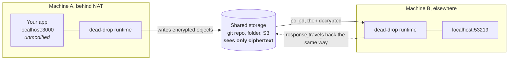

# dead-drop

**Build the application. Bring the transport. dead-drop connects them.**

dead-drop is a local-first runtime that lets applications on different machines talk to each other through infrastructure you already have: a git repository, a shared or synced folder, object storage, or an adapter you write yourself. There is nothing to deploy, no public endpoint, no broker, and the application does not need to know how its bytes move.

Neither machine listens on a public port. Both write and read encrypted objects in a place they can already both reach, which is why this works from behind NAT, from a CI runner, or from a locked-down corporate network.



`ddrop connect` gives you an ordinary local URL. Whatever you point at it, curl or a browser or a client library, talks to the app on the other machine without knowing any of the above happened.

```bash
# machine A: an ordinary Express app on :3000, unmodified
ddrop start &                                             # the runtime, reading ./deaddrop.config.json
ddrop expose --target http://localhost:3000 --name my-api

# machine B
ddrop connect machine-a/my-api
# http://127.0.0.1:53219  →  curl it, open it in a browser, point a client at it
```

Both machines need a `deaddrop.config.json` first: same workspace secret, same transport. The quick start below writes one.

## What this is, and what it is not

dead-drop is genuinely useful when you want two machines to talk and the network between them is the problem: a laptop behind NAT, a locked-down corporate environment, a CI runner, an air-gapped review box that can still reach a git remote. It is a real runtime with encryption, retries, failover, deduplication, health-based routing and observability.

It is **not** a message broker, and it will not pretend to be one. A round trip over a git remote costs seconds, not milliseconds. If you have Kafka, use Kafka. dead-drop is for the case where standing up infrastructure is the expensive part.

Delivery is **at-least-once**. Ordering is best-effort per recipient. Both are stated plainly in [docs/guarantees.md](docs/guarantees.md) rather than buried.

## Install

Requires Node.js 20.11 or newer.

```bash
npm install -g @fyrlabs/dead-drop
```

## Quick start: two machines, a shared folder

```bash
# Once, on either machine:
ddrop keygen                      # prints ddk1_…, share it with the other peer, securely
export DEADDROP_SECRET='ddk1_…'
ddrop init --name demo            # writes deaddrop.config.json
```

`deaddrop.config.json`:

```json
{
  "dataDir": ".deaddrop",
  "workspaces": [
    {
      "name": "demo",
      "peerId": "machine-a",
      "secrets": ["${env:DEADDROP_SECRET}"],
      "transports": [{ "use": "filesystem", "config": { "root": "/Volumes/shared/deaddrop" } }],
      "exposures": [{ "name": "my-api", "type": "http", "target": "http://localhost:3000" }]
    }
  ]
}
```

`ddrop start` runs in the foreground, so the commands after it belong in a second shell:

```bash
ddrop start          # machine A
ddrop start          # machine B, same secret, peerId "machine-b", no exposures
ddrop discover       # machine B sees machine-a and its exposures
ddrop connect machine-a/my-api
```

Client commands find the runtime through the `dataDir` in the config they discover, so run them from the directory holding `deaddrop.config.json`, or pass `--config` or `--socket`.

## Quick start: over GitHub

Data moves by pushing and pulling a dedicated branch. Authentication is whatever `gh` already has; dead-drop never sees a token.

```bash
gh auth login && gh auth setup-git
```

```json
{
  "use": "github",
  "config": {
    "repo": "your-org/deaddrop-workspace",
    "workDir": "./.deaddrop/github",
    "createIfMissing": true
  }
}
```

dead-drop writes to a `deaddrop-data` orphan branch, so your repository's real history is untouched. Deleting that branch discards undelivered messages and nothing else.

## Native SDK

For applications that want dead-drop-native interactions rather than HTTP proxying:

```ts
import { createClient } from '@fyrlabs/dead-drop-sdk';

// dataDir must match the running runtime's; it defaults to ~/.deaddrop.
const ddrop = createClient({ workspace: 'demo', dataDir: '.deaddrop' });

await ddrop.publish('events/orders', { type: 'order.created', id: 42 });
const sum = await ddrop.call('machine-a', 'math.add', { a: 10, b: 20 });
```

And on the serving side, from an embedded runtime:

```ts
workspace.service('math', {
  add: ({ a, b }) => a + b,
});
```

The SDK is optional. Proxy mode needs none of it.

## Writing a transport

A transport is an ordinary npm package. Nothing in this repository changes, and nothing needs to be merged.

```ts
import { defineTransport } from '@fyrlabs/dead-drop-transport-sdk';

export const acmeTransport = defineTransport({
  id: 'acme',
  capabilities: {
    kind: 'store',
    ordering: 'partition',
    binaryPayloads: true,
    delete: true,
    watch: false,
    orderedList: true,
  },
  create(config, context) {
    return {
      kind: 'store',
      async put(key, data) { /* … */ },
      async get(key) { /* … */ },
      async list(prefix, options) { /* … */ },
      async delete(key) { /* … */ },
      async health() { return { status: 'healthy' }; },
      async close() {},
    };
  },
});
```

Four methods. dead-drop supplies framing, encryption, chunking, acknowledgement, retries, deduplication, dead-lettering and adaptive polling on top. Run the conformance suite against your adapter before publishing it. See [docs/writing-a-transport.md](docs/writing-a-transport.md).

## Commands

```text
ddrop start                         run the runtime
ddrop status                        runtime, workspaces, transports
ddrop list                          workspaces this runtime serves
ddrop discover                      peers visible in the workspace
ddrop transport list | health       transport scores and health
ddrop expose --target <url> --name <n>
ddrop expose <dir> --name <n>
ddrop connect <peer>/<exposure>
ddrop call <peer> <channel> --input '{"a":1}'
ddrop publish <channel> --input '{...}'
ddrop logs | metrics
ddrop trace [<traceId>]             recent traces, or one as a span tree
ddrop keygen | init
```

`--json` makes the output machine-readable, including errors. `call` always returns JSON; `metrics` is Prometheus text either way.

## Packages

| Package | Purpose |
| --- | --- |
| `@fyrlabs/dead-drop-protocol` | Envelope, framing, encryption, chunking. No dependencies. |
| `@fyrlabs/dead-drop-transport-sdk` | `defineTransport` and the conformance suite. |
| `@fyrlabs/dead-drop-core` | Transport manager, reliability, mailbox engine, observability. |
| `@fyrlabs/dead-drop-runtime` | Workspaces, exposures, discovery, control plane. |
| `@fyrlabs/dead-drop-sdk` | Application client. |
| `@fyrlabs/dead-drop` | The `ddrop` command. |
| `@fyrlabs/dead-drop-transport-filesystem` | Reference transport: any directory. |
| `@fyrlabs/dead-drop-transport-git` | Any git remote. |
| `@fyrlabs/dead-drop-transport-github` | GitHub, via `gh` for auth and repo management. |
| `@fyrlabs/dead-drop-transport-memory` | In-process, for tests and examples. |

## Security

One 32-byte secret per workspace. Holding it *is* membership. Everything on a transport is AES-256-GCM ciphertext including the envelope header, so channel, peer and workspace names never appear in clear text. The transport is treated as hostile storage.

What is *not* protected: message sizes, timing, and the object keys the mailbox writes. Read [docs/security-model.md](docs/security-model.md) before deciding this fits your threat model.

## Documentation

- [Architecture](docs/architecture.md): how the pieces fit and why
- [Configuration reference](docs/configuration.md): every field, its type and its default
- [Security model](docs/security-model.md): threat model, key rotation, what is exposed
- [Delivery guarantees](docs/guarantees.md): at-least-once, ordering, duplicates
- [Writing a transport](docs/writing-a-transport.md)
- [Operations](docs/operations.md): running it, metrics, troubleshooting
- [Vision](docs/vision.md): where this is going, and what it refuses to become
- [Testing](docs/testing.md): what is covered automatically, and a walkthrough for what needs a human
- [Decision records](docs/adr/): choices that deviate from the original design, and why

## Development

```bash
npm install
npm run verify      # lint, build, test with coverage
npm test            # tests only
```

The git transport tests require a `git` binary. Everything else runs with no external dependencies, no network and no credentials.

## Licence

Apache-2.0.
