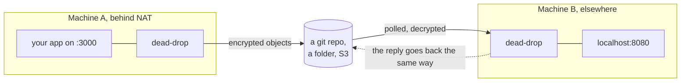

# dead-drop

**Build the application. Bring the transport. dead-drop connects them.**

Two machines talk to each other through infrastructure they already share: a git repository, a synced folder, object storage. Neither one listens on a public port, so this works from behind NAT, from a CI runner, or from a locked-down corporate network.



## Install

Requires Node.js 20.11 or newer.

```bash
npm install -g @fyrlabs/dead-drop
```

## Try it on one machine

Two peers and a folder between them. Nothing to edit, nothing to export.

```bash
mkdir -p try/a try/b try/shared try/site
echo '<h1>it works</h1>' > try/site/index.html

(cd try/a && ddrop init --name demo --peer peer-a --root ../shared)
(cd try/b && ddrop init --name demo --peer peer-b --root ../shared)
cp try/a/.deaddrop/secret try/b/.deaddrop/secret   # one secret per workspace
```

`ddrop start` runs in the foreground, so give each peer its own shell, or background them:

```bash
(cd try/a && exec ddrop start) &
(cd try/b && exec ddrop start) &

(cd try/a && ddrop expose ../site --name site)
(cd try/b && ddrop discover)                       # peer-a shows up here
(cd try/b && exec ddrop connect peer-a/site --port 8080) &

curl http://127.0.0.1:8080/index.html              # <h1>it works</h1>
```

The `exec` matters: without it you background a shell that starts the runtime and exits, so `kill` reaps the wrapper and leaves the runtime serving.

Look in `try/shared` while it runs. The object keys name the workspace and the peers on purpose, so an operator can understand what is there; every file is ciphertext.

Stop everything with `kill %1 %2 %3`, and delete `try/` when you are done.

## Two real machines

The same thing, with the folder replaced by something both machines can reach and the secret carried across by hand.

```bash
# on each machine, with its own --peer name
ddrop init --name demo --peer machine-a --root ~/Dropbox/deaddrop
```

Then copy `.deaddrop/secret` from the first machine to the second, over a channel you trust. Holding that secret *is* membership in the workspace.

To expose a real local server rather than a directory:

```bash
ddrop expose --target http://localhost:3000 --name my-api   # machine A
ddrop connect machine-a/my-api                              # machine B
```

`ddrop connect` prints an ordinary local URL. curl it, open it in a browser, or point a client library at it; nothing on that side knows any of the above happened.

### Over a git repository instead

Data moves by pushing and pulling a dedicated branch. Authentication is whatever `gh` already has, and dead-drop never sees a token.

```bash
gh auth login && gh auth setup-git
ddrop init --name demo --peer machine-a --root unused   # then edit the transport block:
```

```json
{
  "use": "github",
  "config": {
    "repo": "your-org/deaddrop-workspace",
    "workDir": "./.deaddrop/github",
    "createIfMissing": true
  }
}
```

Objects go to a `deaddrop-data` orphan branch, so the repository's real history is untouched. Deleting that branch discards undelivered messages and nothing else.

## What this is, and what it is not

Useful when two machines need to talk and the network between them is the problem. It is a real runtime: encryption, retries, failover, deduplication, health-based routing, observability.

It is **not** a message broker and will not pretend to be one. A round trip over a git remote costs seconds, not milliseconds. If you have Kafka, use Kafka.

Delivery is **at-least-once** and ordering is best-effort per recipient, stated plainly in [docs/guarantees.md](docs/guarantees.md) rather than buried.

## Security

One 32-byte secret per workspace. Holding it *is* membership. Every frame is AES-256-GCM ciphertext, envelope header included, so a channel name or a payload never appears in clear text.

**Object keys are the deliberate exception.** They read `ws/<workspace>/inbox/<peer>/<id>.ddf`, so anyone who can read the transport can see workspace names, peer names and roughly how much traffic there is. That is a design choice: an operator looking at a git repository should be able to tell what it holds. Message sizes and timing are visible for the same reason.

Read [docs/security-model.md](docs/security-model.md) before deciding this fits your threat model.

## Commands

```text
ddrop init [--root <folder>]        write a config, and a secret beside it
ddrop start                         run the runtime
ddrop status                        runtime, workspaces, transports
ddrop discover                      peers visible in the workspace
ddrop expose --target <url> --name <n>
ddrop expose <dir> --name <n>
ddrop connect <peer>/<exposure>
ddrop call <peer> <channel> --input '{"a":1}'
ddrop publish <channel> --input '{...}'
ddrop list | logs | metrics
ddrop transport list | health       transport scores and health
ddrop trace [<traceId>]             recent traces, or one as a span tree
ddrop keygen                        a new workspace secret, for rotation
```

`--json` makes the output machine-readable, including errors. Client commands find the runtime through the config they discover, so run them from the directory holding `deaddrop.config.json`, or pass `--config` or `--socket`.

## Documentation

- [Configuration reference](docs/configuration.md): every field, its type and its default
- [Using it from code](docs/sdk.md): the client, services, and the package entry points
- [Architecture](docs/architecture.md): how the pieces fit and why
- [Security model](docs/security-model.md): threat model, key rotation, what is exposed
- [Delivery guarantees](docs/guarantees.md): at-least-once, ordering, duplicates
- [Writing a transport](docs/writing-a-transport.md): four methods, and a conformance suite to run against them
- [Operations](docs/operations.md): running it, metrics, troubleshooting
- [Vision](docs/vision.md): where this is going, and what it refuses to become
- [Testing](docs/testing.md): what is covered automatically, and what still needs a human
- [Decision records](docs/adr/): choices that deviate from the original design, and why

## Development

```bash
npm install
npm run verify      # lint, build, test with coverage
```

The git transport tests need a `git` binary. Everything else runs with no network and no credentials. Contributor guidance is in [CONTRIBUTING.md](CONTRIBUTING.md); [AGENTS.md](AGENTS.md) is the same ground for coding agents.

## Licence

Apache-2.0.
