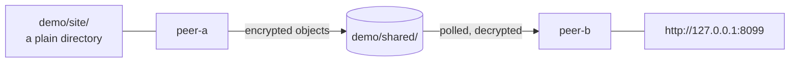

# Demo: two peers, one shared folder

Two runtimes on this machine talk to each other through `demo/shared/`. Nothing listens on a public port, and nothing leaves the folder in plain text. Pretend the folder is Dropbox, a network share, or a git repo, and the two peers are two laptops.



## Run it

Nothing needs editing. Three terminals, all from the repository root.

**Terminal 1** creates the secret and starts peer-a:

```bash
alias ddrop="node $PWD/packages/dead-drop/dist/cli/bin.js"   # or: npm i -g @fyrlabs/dead-drop
npm run build                                                # once, if you have not built yet

export DEADDROP_SECRET=$(ddrop keygen | grep '^ddk1_')
echo "$DEADDROP_SECRET"                                      # copy this, both other terminals need it

cd demo/peer-a && ddrop start
```

**Terminal 2** starts peer-b:

```bash
alias ddrop="node $PWD/packages/dead-drop/dist/cli/bin.js"
export DEADDROP_SECRET='ddk1_…'                              # the same one

cd demo/peer-b && ddrop start
```

**Terminal 3** is you, on peer-b's side of the world:

```bash
alias ddrop="node $PWD/packages/dead-drop/dist/cli/bin.js"
export DEADDROP_SECRET='ddk1_…'
cd demo/peer-b

ddrop discover                       # peer-a shows up, with the exposures it publishes
ddrop connect peer-a/site --port 8099
```

Then open <http://127.0.0.1:8099> or `curl http://127.0.0.1:8099/index.html`.

Look inside `demo/shared/` while it runs. The paths name the workspace and the peers on purpose, so an operator can understand what is going on; every file is ciphertext.

## Worth trying next

```bash
ddrop status --json                  # transports, health, scores, mailbox state
ddrop transport health               # re-probe, rather than read the cached answer
ddrop logs --level warn
```

Swap peer-a's exposure for a real local server it should proxy instead of a directory:

```json
{ "name": "site", "type": "http", "target": "http://localhost:3000" }
```

Or point both peers at GitHub instead of a folder, by replacing the `transports` entry in both configs:

```json
{ "use": "github", "config": { "repo": "you/your-private-repo", "createIfMissing": true } }
```

That needs `gh auth login && gh auth setup-git` first. dead-drop never sees a token.

## Things that will trip you up

- **Every terminal needs `DEADDROP_SECRET`**, including the one only running `ddrop discover`. Client commands read the config file to find the runtime's socket, and parsing it resolves `${env:DEADDROP_SECRET}` before anything else happens. A missing one fails at config load, not at connect.
- **`peerId` must differ between the two configs.** It defaults to the machine hostname, so two runtimes on one box that both take the default share a mailbox address and fail with `DECODE_FAILED`. Both configs here set it explicitly.
- **`ddrop start` runs in the foreground.** That is why this needs three terminals.
- Paths inside a config resolve **against the config file's directory**, not your working directory. That is why `../shared` works from anywhere.

## Reset

```bash
rm -rf demo/shared demo/peer-a/.deaddrop demo/peer-b/.deaddrop
```
