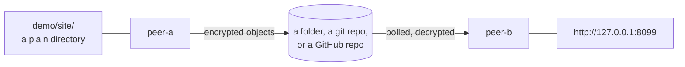

# Demo: two peers, one shared thing in the middle

Two runtimes on this machine talk to each other through infrastructure that is not a network: a folder, a git repository, or a GitHub repository. Nothing listens on a public port, and what sits in the middle only ever holds ciphertext. Pretend the two peers are two laptops.



## Run it

Three terminals, all starting from the repository root. Nothing needs editing for the folder and git transports.

```bash
npm run build            # once
demo/use filesystem      # or: demo/use git
```

Then in **each** of the three terminals:

```bash
. demo/env.sh            # defines `ddrop`, loads the shared secret
```

**Terminal 1**

```bash
cd demo/peer-a && ddrop start
```

**Terminal 2**

```bash
cd demo/peer-b && ddrop start
```

**Terminal 3**

```bash
cd demo/peer-b
ddrop discover                        # peer-a appears, with the exposures it publishes
ddrop connect peer-a/site --port 8099
```

Open <http://127.0.0.1:8099> or `curl http://127.0.0.1:8099/index.html`.

While it runs, look at what is in the middle: `demo/shared/` for the folder transport, or `git -C demo/peer-a/.deaddrop/git-work log --oneline deaddrop-data` for the git one. Object paths name the workspace and the peers on purpose, so an operator can understand what is going on. The contents are ciphertext.

## Switching transports

`demo/use <transport>` copies one of the `deaddrop.<transport>.json` files over each peer's `deaddrop.config.json`, so every command above stays the same whichever transport is underneath. Stop both runtimes first.

| | what it needs | round trip |
| --- | --- | --- |
| `demo/use filesystem` | nothing | milliseconds |
| `demo/use git` | nothing; it creates `demo/shared-repo.git` for you | about a second |
| `demo/use github` | `gh auth login && gh auth setup-git`, and a repo name | tens of seconds |

For GitHub, put a repository you own into `repo` in **both** `peer-a/deaddrop.github.json` and `peer-b/deaddrop.github.json`, then run `demo/use github`. It writes to a `deaddrop-data` orphan branch and leaves the repository's real history alone. `createIfMissing` is on, so a repository that does not exist yet will be created private.

## Worth trying next

```bash
ddrop status --json          # transports, health, scores, mailbox state
ddrop transport health       # re-probe rather than read the cached answer
ddrop logs --level warn
ddrop trace                  # recent traces; a message id is its trace id
```

Swap peer-a's exposure for a real local server it should proxy instead of a directory, in whichever variant you are using:

```json
{ "name": "site", "type": "http", "target": "http://localhost:3000" }
```

## Things that will trip you up

- **Every terminal needs the secret**, including the one that only runs `ddrop discover`. Client commands read the config file to find the runtime's socket, and parsing it resolves `${env:DEADDROP_SECRET}` before anything else, so a missing secret fails at config load rather than at connect. `. demo/env.sh` is what handles this; it keeps the secret in `demo/.secret`, which is gitignored.
- **`peerId` must differ between the two configs.** It defaults to the machine hostname, so two runtimes on one box that both take the default share a mailbox address and fail with `DECODE_FAILED`. Every variant here sets it explicitly.
- **`ddrop start` runs in the foreground**, which is why this needs three terminals.
- Paths inside a config resolve **against the config file's directory**, not your working directory. That is why `../shared` and `../site` work from anywhere.
- The git transport is a real git remote doing real pushes, so the first request after a restart pays for a clone. Seconds, not milliseconds, and that is the honest cost of the design.

## Reset

```bash
rm -rf demo/shared demo/shared-repo.git demo/.secret \
       demo/peer-a/.deaddrop demo/peer-a/deaddrop.config.json \
       demo/peer-b/.deaddrop demo/peer-b/deaddrop.config.json
```

No globs on purpose: under zsh a pattern that matches nothing aborts the whole command, so `demo/peer-*/...` fails on an already-clean tree.
